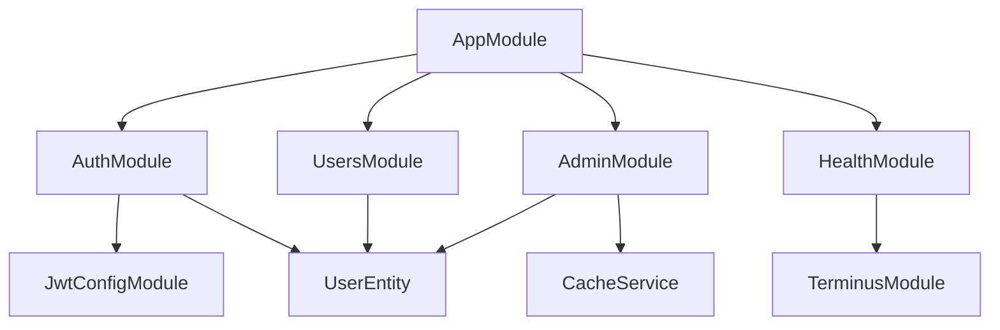
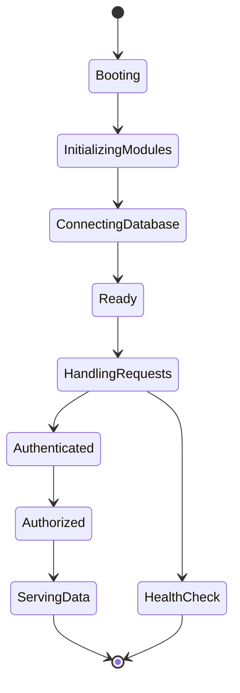

<!-- LOGO & TITLE -->
<p align="center">
  
</p>

<h1 align="center">Nebura API</h1>
<p align="center">
  <b>Version:</b> 1.0.0<br>
  <b>License:</b> MIT<br>
  <b>Author:</b> <a href="https://twitter.com/kammysliwiec" target="_blank">Kamil Myśliwiec</a>
</p>

<!-- BADGES -->
<p align="center">
  <a href="https://nestjs.com/" target="_blank"></a>
  <a href="https://www.npmjs.com/~nestjscore" target="_blank"></a>
  <a href="https://circleci.com/gh/nestjs/nest" target="_blank"></a>
  <a href="https://discord.gg/G7Qnnhy" target="_blank"></a>
  <a href="https://opencollective.com/nest#backer" target="_blank"></a>
  <a href="https://opencollective.com/nest#sponsor" target="_blank"></a>
</p>

---

## 🗂️ Table of Contents

- [Overview](#overview)
- [Features](#features)
- [Architecture](#architecture)
  - [Module Graph](#module-graph)
  - [System State Diagram](#system-state-diagram)
- [Security](#security)
- [Scalability](#scalability)
- [Requirements](#requirements)
- [Installation](#installation)
- [Configuration](#configuration)
- [Usage](#usage)
- [API Documentation](#api-documentation)
- [Monitoring & Health](#monitoring--health)
- [Testing](#testing)
- [Deployment](#deployment)
- [Advanced Menus](#advanced-menus)
- [Support](#support)
- [Contributing](#contributing)
- [License](#license)

---

## 📝 Overview

**Nebura API** is an enterprise-grade, cloud-native, and highly modular RESTful API framework built with [NestJS](https://nestjs.com/) and TypeScript. It is engineered for security, scalability, and extensibility, providing a robust foundation for mission-critical applications.

---

## 🚀 Features

| Feature                 | Description                                                    |
| ----------------------- | -------------------------------------------------------------- |
| Modular Architecture    | Feature-based modules for Auth, Users, Admin, Health, and more |
| TypeORM Integration     | PostgreSQL support with advanced entity modeling               |
| JWT Authentication      | Stateless, secure authentication with RBAC                     |
| Rate Limiting           | Multi-tier request throttling (short, medium, long)            |
| Caching                 | Global cache for performance optimization                      |
| Validation              | DTO-based validation and transformation                        |
| API Versioning          | URI-based versioning for backward compatibility                |
| Swagger/OpenAPI         | Auto-generated, interactive API docs                           |
| Security Best Practices | Helmet, input sanitization, secure HTTP headers                |
| Health Checks           | Real-time system and DB health endpoints                       |
| Logging                 | Structured, colorized logs with Pino and custom logger         |
| Extensible Middleware   | Easily add custom middleware for authentication, roles, etc.   |
| Cloud-Ready             | Docker, Kubernetes, AWS, GCP, Azure, and serverless compatible |
| Monitoring              | Built-in health endpoints and metrics                          |
| Audit Logging           | Tracks authentication and admin actions                        |

---

## 🏗️ Architecture

Nebura follows a layered, modular, and extensible architecture.

### Directory Structure

```
src/
├── adapters/           # Database strategies (JWT, Local)
├── entity/             # TypeORM entities
├── interfaces/
│   └── http/
│       ├── controllers/
│       └── routes/
├── shared/             # Shared utilities (Logger, etc.)
├── app.module.ts       # Root module
├── main.ts             # Application entry point
└── jwt.module.ts       # JWT configuration module
```

### Module Graph



### System State Diagram



---

## 🛡️ Security

- **JWT Authentication:** All protected endpoints require valid JWT tokens.
- **Role-Based Access Control:** Fine-grained access for admin, developer, moderator, and user roles.
- **Helmet Middleware:** Secure HTTP headers (CSP, COEP, XSS, HSTS, etc.).
- **Input Validation:** DTO-based validation with whitelisting and transformation.
- **Rate Limiting:** Prevents brute-force and DoS attacks with configurable throttling.
- **Environment Variables:** Secrets and credentials are never hardcoded.
- **Audit Logging:** All authentication and admin actions are logged.
- **Static Analysis:** Recommended integration with Snyk, SonarQube, or similar tools.

---

## 📈 Scalability

- **Stateless API:** JWT authentication enables horizontal scaling.
- **Global Caching:** Reduces DB load and improves response times.
- **Connection Pooling:** Efficient PostgreSQL resource usage.
- **Cloud-Native:** Docker, Kubernetes, and serverless ready.
- **Configurable Modules:** Add/remove features as needed.
- **Observability:** Health endpoints and logging for monitoring.

---

## ⚙️ Requirements

| Component  | Minimum Version |
| ---------- | --------------- |
| Node.js    | 18.x            |
| npm        | 9.x             |
| PostgreSQL | 13.x            |
| Docker     | Optional        |

---

## 🛠️ Installation

```bash
# Clone the repository
git clone https://github.com/your-org/nebura.git
cd nebura

# Install dependencies
npm install
```

---

## 🧩 Configuration

Create a `.env` file in the project root:

```env
PORT=3000
DB_HOST=localhost
DB_PORT=5432
DB_USERNAME=postgres
DB_PASSWORD=yourpassword
DB_NAME=nebura
JWT_SECRET=your_jwt_secret
JWT_EXPIRES_IN=1d
```

---

## ▶️ Usage

### Running the Application

```bash
# Development mode
npm run start

# Watch mode (auto-reload)
npm run start:dev

# Production mode
npm run start:prod
```

API available at: `http://localhost:3000/v1/`

---

## 📚 API Documentation

Nebura provides interactive API documentation via Swagger:

- **Swagger UI:** [http://localhost:3000/v1/docs](http://localhost:3000/v1/docs)
- **OpenAPI JSON:** [http://localhost:3000/v1/docs/download](http://localhost:3000/v1/docs/download)

**Features:**

- JWT Bearer authentication support
- Try out endpoints interactively
- Download OpenAPI specification

---

## 📊 Monitoring & Health

Nebura exposes health and metrics endpoints for monitoring:

| Endpoint            | Description                  |
| ------------------- | ---------------------------- |
| `/v1/health`        | General health check         |
| `/v1/health/db`     | Database connectivity status |
| `/v1/health/memory` | Memory usage and limits      |
| `/v1/health/disk`   | Disk space and I/O           |

**Sample Health Response:**

```json
{
  "status": "ok",
  "info": {
    "database": { "status": "up" },
    "memory": { "status": "up", "used": "120MB" }
  }
}
```

---

## 🧪 Testing

Nebura includes comprehensive unit and e2e test support:

```bash
# Run unit tests
npm run test

# Run end-to-end tests
npm run test:e2e

# Generate test coverage report
npm run test:cov
```

---

## 🚀 Deployment

Nebura is cloud-ready and can be deployed to any modern platform.

### Deploying to AWS with Mau

```bash
npm install -g @nestjs/mau
mau deploy
```

Or follow the [NestJS deployment guide](https://docs.nestjs.com/deployment) for Docker, Kubernetes, and other platforms.

---

## 🧭 Advanced Menus

<details>
  <summary><b>Module Navigation</b></summary>

- [Auth Module](src/interfaces/http/routes/auth)
- [Users Module](src/interfaces/http/routes/users)
- [Admin Module](src/interfaces/http/routes/admin)
- [Health Module](src/interfaces/http/routes/health)
- [Shared Utilities](src/shared)
- [Entities](src/entity)
</details>

<details>
  <summary><b>System States</b></summary>

| State            | Description                          |
| ---------------- | ------------------------------------ |
| Booting          | Application is starting              |
| Initializing     | Modules and dependencies are loading |
| Ready            | API is ready to accept requests      |
| HandlingRequests | Processing incoming HTTP requests    |
| HealthCheck      | Performing health and status checks  |
| Authenticated    | User is authenticated via JWT        |
| Authorized       | User has required role/permissions   |
| ServingData      | Data is being served to the client   |

</details>

<details>
  <summary><b>API Endpoints Overview</b></summary>

| Method | Endpoint                | Description            | Auth Required |
| ------ | ----------------------- | ---------------------- | ------------- |
| POST   | `/v1/auth/login`        | User login             | No            |
| GET    | `/v1/auth/me`           | Get current user       | Yes           |
| GET    | `/v1/users/:id`         | Get user by ID         | Yes           |
| GET    | `/v1/health`            | Health check           | No            |
| GET    | `/v1/admin/users`       | List all users (admin) | Yes (Admin)   |
| POST   | `/v1/admin/cache/clear` | Clear cache (admin)    | Yes (Admin)   |

</details>

---

## 🆘 Support

- **Documentation:** [NestJS Docs](https://docs.nestjs.com)
- **Community:** [Discord](https://discord.gg/G7Qnnhy)
- **Enterprise Support:** [NestJS Enterprise](https://enterprise.nestjs.com)
- **Jobs Board:** [NestJS Jobs](https://jobs.nestjs.com)

---

## 🤝 Contributing

Nebura is an open-source project. Contributions, issues, and feature requests are welcome! Please read our [contributing guidelines](CONTRIBUTING.md) before submitting a pull request.

---

## 📄 License

This project is licensed under the [MIT License](LICENSE).

---

<p align="center">
  <b>Built with ❤️ using NestJS and TypeScript</b>
</p>
